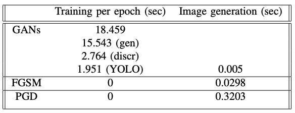

## Adversarial Learning on YOLOv8 Detection Model Using GANs

### Relevant Files
`training_google.ipynb`: GANs training
`networks.py`: Generator and Discriminator architectures and loss functions
`data.py`: Dataloader for GANs training (and other things)
`create_fgsm_images.ipynb`: create dataset of FGSM attacked examples
`create_pgd_images.ipynb`: create dataset of PGD attacked examples

### YOLO training
1. 

### GANs training
1. Unzip data to `./gans_data/data_google_large/`.
2. Verify `./args_google_data_32.yaml` exists and references correct data paths.
3. Verify `./GANs_training/` exists for logging purposes.
4. Run `training_google.ipynb`.

### Results
GANs training convergence

YOLO performance on original data and adversarial data before re-training

YOLO performance on original data and adversarial data after re-training

Timing benchmarks of each attack

Examples of images produced by each adversarial attack

### Observations
Training YOLO on original + adversarial data does indeed produce a more robust model. As shown in the first two tables, the re-trained YOLO outperforms the original YOLO on almost every metric regardless of the type of attack.

The GANs attack takes time to train, but at inference time is much faster than FGSM and PGD due to the latter two methods requiring inference and backprop through the YOLO model which is substantially bigger than our generator.